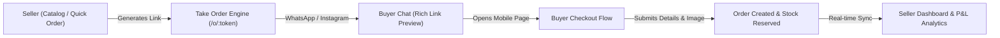
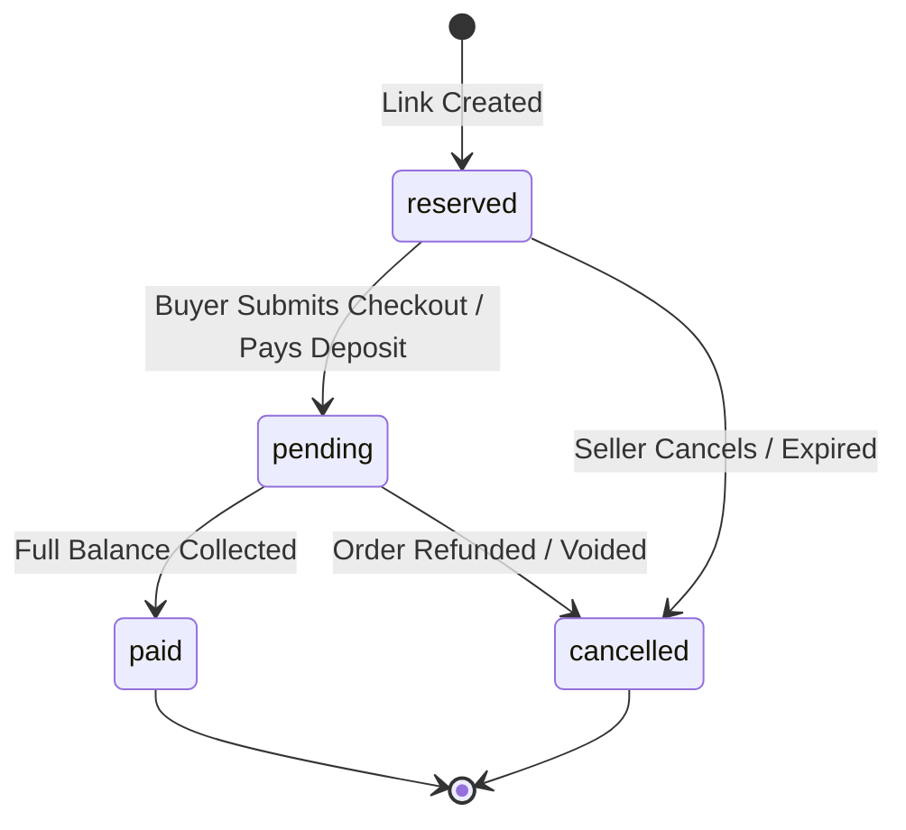
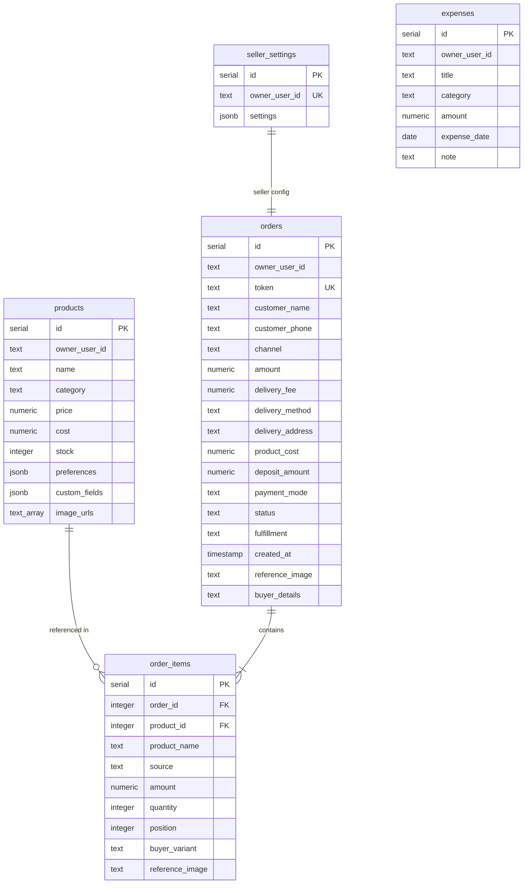
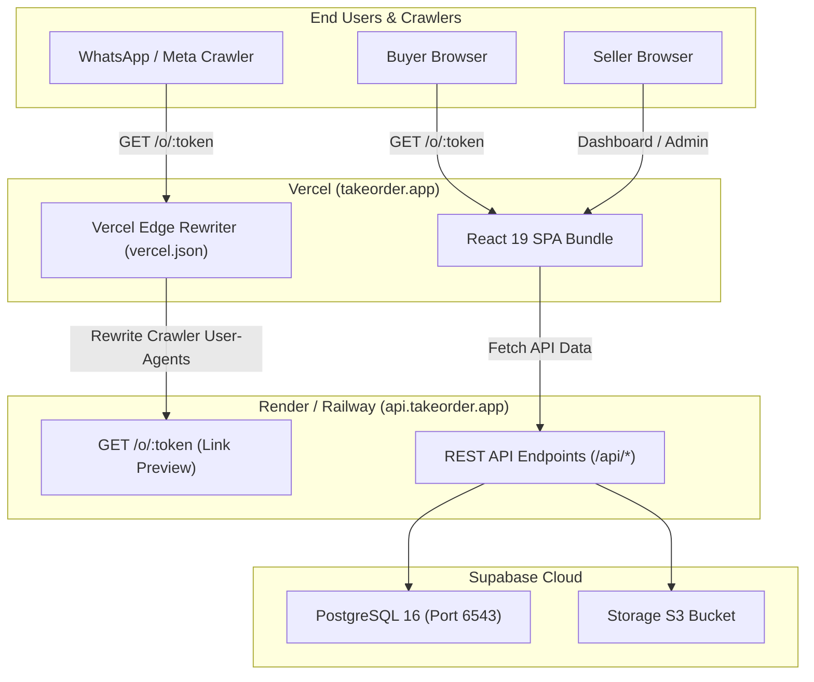

# Take Order — Full Architecture, Stack, Business Logic & Production Deployment Guide

> **Document Status**: Production Readiness & Architectural Reference  
> **Target Version**: Take Order v1.0 Production Release  
> **Scope**: Full platform audit, technical stack, complete feature inventory, business logic rules, implemented vs. pending integrations, and production deployment configuration guide.

---

## Table of Contents

1. [Executive Summary & Core Value Proposition](#1-executive-summary--core-value-proposition)
2. [Complete Technology Stack](#2-complete-technology-stack)
3. [Implemented Integrations vs. Pending Integrations](#3-implemented-integrations-vs-pending-integrations)
4. [Complete Feature Breakdown & Screen Inventory](#4-complete-feature-breakdown--screen-inventory)
5. [Core Business Logic & Accounting State Machines](#5-core-business-logic--accounting-state-machines)
6. [Data Models & Database Schema Architecture](#6-data-models--database-schema-architecture)
7. [Link Preview & Crawler Architecture](#7-link-preview--crawler-architecture)
8. [Production Deployment Configuration Checklist](#8-production-deployment-configuration-checklist)
9. [Security, Performance & Operational Invariants](#9-security-performance--operational-invariants)

---

## 1. Executive Summary & Core Value Proposition

**Take Order** is an all-in-one mobile-first commerce operating system designed specifically for conversational social commerce sellers across Africa and emerging markets (operating primarily via WhatsApp, Instagram, TikTok, and direct messaging).

### The Problem It Solves
Traditional e-commerce platforms (Shopify, WooCommerce) assume buyers browse large catalogs on web browsers, add items to complex shopping carts, and check out with credit cards. In contrast, modern social sellers close deals in direct messaging chats:
- Sellers repeatedly re-type bank details, prices, and delivery terms.
- Buyers send screenshots of products with custom requests, which get lost in chat threads.
- Orders are agreed upon verbally, leading to uncollected balances ("owing clients"), inventory mismatches, and double-selling.
- When sellers share links in chat apps, bare links look untrustworthy without rich product cards, pictures, and prices.

### How Take Order Bridges This Gap
1. **Frictionless Link Generation**: In seconds, a seller selects an item from their catalog or creates a custom one-off item, defines a payment mode (Full, Deposit, or Reserve), sets delivery fees, and generates a short link (`/o/:token`).
2. **Rich Chat Previews**: When pasted into WhatsApp, Instagram, Telegram, or iMessage, the link automatically unfurls into a rich card displaying the product name, price in local currency, and high-res image.
3. **Structured Buyer Checkout**: Buyers open a lightning-fast mobile page to confirm variant choices (Color, Size), upload reference photos, choose Pickup or Delivery, and enter their shipping address.
4. **Automated Business Operations**: Instantly logs the transaction, reserves inventory, tracks payment collections, updates client profiles, monitors business expenses, and computes real net profit.



---

## 2. Complete Technology Stack

The Take Order codebase is architected as a high-performance TypeScript monorepo managed with `pnpm workspaces`.

### 2.1 Workspace Architecture
```
Duka-Business-Operating-App/
├── artifacts/
│   ├── duka/                   # Modern React 19 Frontend SPA (Vite, Tailwind v4)
│   ├── api-server/             # Express 5.2 Node.js REST API Server
│   └── mockup-sandbox/         # Isolated component preview & development sandbox
├── lib/
│   ├── db/                     # Drizzle ORM PostgreSQL database schemas & pool connection
│   ├── api-zod/                # Shared Zod validation schemas & API contracts
│   └── api-client-react/       # Auto-generated React Query hooks & fetch client
├── scripts/                    # Automation scripts & DB migrations
├── .env.example                # Canonical environment variable reference
├── render.yaml                 # Render cloud deployment specification (API)
├── vercel.json                 # Vercel Edge configuration & crawler rewrite rules
└── pnpm-workspace.yaml         # Monorepo configuration with supply-chain security locks
```

### 2.2 Frontend Stack (`artifacts/duka`)
- **Core Framework**: React 19.1.0 (with React 19 Compiler compatibility).
- **Build Tool**: Vite 7.3.6 with Rollup code-splitting and asset optimization.
- **Language**: TypeScript 5.7+ (strict mode enabled).
- **Styling**: Tailwind CSS v4.1 with custom design tokens, dark mode classes, and modern responsive breakpoints.
- **UI Primitives**: Radix UI primitives (`@radix-ui/react-dialog`, `@radix-ui/react-dropdown-menu`, `@radix-ui/react-popover`, `@radix-ui/react-select`, `@radix-ui/react-tabs`, `@radix-ui/react-tooltip`).
- **Icons**: Lucide React (`lucide-react`).
- **Animation & Transitions**: Framer Motion 12.23.
- **Data Fetching & State**: TanStack React Query v5 (`@tanstack/react-query`).
- **Routing**: Wouter 3.3 (lightweight, zero-dependency SPA routing).
- **Charts & Data Visualization**: Recharts 2.15.
- **Form Validation**: Zod 3.25.
- **Supply-Chain Defense**: `pnpm` enforced `minimumReleaseAge: 1440` (packages must be 24h old before installation).

### 2.3 Backend Stack (`artifacts/api-server`)
- **Runtime**: Node.js 22 LTS.
- **Framework**: Express 5.2.1.
- **Database Layer**: Drizzle ORM 0.45 with `pg` (node-postgres) driver.
- **Bundler & Execution**: `esbuild` 0.28 for high-speed bundle compilation and ESM output.
- **Logging**: Pino 9.14 + `pino-http` structured logging with `pino-pretty` development transport.
- **Security & Headers**: Helmet 8.0, CORS 2.8 with origin regex matching, Express Rate Limit 7.5.
- **Validation**: Shared Zod schemas (`@workspace/api-zod`) validating request bodies and query parameters.
- **Testing**: Native Node.js test runner (`node:test`, `node:assert/strict`) with isolated in-memory seeded databases and integration HTTP suites.

### 2.4 Database & Storage Infrastructure
- **Database Engine**: PostgreSQL 16 hosted on Supabase (AWS us-west-2).
- **Connection Management**:
  - Development / Direct: Supabase Session Pooler (port 5432).
  - Production High-Concurrency: Supabase Transaction Pooler with PgBouncer (port 6543, `?sslmode=require`).
- **Object Storage**: Supabase Storage S3-compatible bucket (`order-reference-images`) for high-resolution buyer reference images and seller assets.

---

## 3. Implemented Integrations vs. Pending Integrations

| Integration | Category | Status | Implementation Details |
| :--- | :--- | :--- | :--- |
| **Clerk Authentication** | Identity & Auth | **Implemented** | Seamless custom auth flow, session tokens, JWT verification in Express middleware, automatic redirects, logout handler. |
| **Supabase PostgreSQL** | Database | **Implemented** | Drizzle ORM models, relations, automatic migrations, foreign key constraints, connection pooling. |
| **Supabase Object Storage** | Media Storage | **Implemented** | Direct file uploads via `/api/upload` endpoint, UUID hashing, public CDN URL generation for buyer reference photos. |
| **Open Graph / Meta Crawler Engine** | Social Media | **Implemented** | Server-side HTML generation for WhatsApp, Meta (`facebookexternalhit`), Twitterbot, Telegram, Slack, Applebot. |
| **RevenueCat Web SDK** | Subscriptions | **Implemented** | Complete billing portal, Pro and Pro+ tiers, entitlement listeners, simulated sandbox, upgrade modals. |
| **Paystack Payment Gateway** | Payments | **Pending / Deferred** | Explicitly out of scope for this pass. Architecture prepared for webhook verification, mobile money, and split disbursement. |
| **WhatsApp Cloud API** | Messaging Bot | **Pending / Future** | Direct WhatsApp bot order status updates and automated message dispatches (currently uses `whatsapp://send` URI scheme). |
| **Logistics Carrier API** | Fulfillment | **Pending / Future** | Automatic courier dispatch (e.g. Fez, Gokada, Hubtel, Bolt Business). Current implementation supports flat and custom seller-managed rates. |
| **SMS Gateway** | Notifications | **Pending / Future** | Buyer SMS dispatch for offline order notifications (Hubtel / Twilio / Africa's Talking). |

---

## 4. Complete Feature Breakdown & Screen Inventory

### 4.1 Authentication & Profile Management
- **Custom Branded Sign-in / Sign-up**: Beautifully styled authentication screens matching the Take Order design system (forest green accents `#0F6E6B`, clean typography, responsive layout).
- **Session Lifecycle**: Auto-refreshing session tokens; graceful redirection to `/sign-in` when tokens expire or are invalidated.
- **Explicit Logout**: Added to the account menu, clearing Clerk tokens and local session storage before redirecting.

### 4.2 First-Run Guided Onboarding
- **Zero-Data State Detection**: Automatically differentiates a brand-new seller from an established business with zero activity in a specific date window.
- **3-Step Setup Checklist**:
  1. Add your first product to the catalog.
  2. Create your first Take Order link.
  3. Share your link and explore the analytics dashboard.
- **Automatic Transition**: Once the seller has created at least 1 product or 1 order, the UI permanently unlocks the full analytics dashboard.

### 4.3 Analytics Dashboard
- **Scoping Controls**: Filter metrics across Today, Last 7 Days, Last 30 Days, or All Time.
- **Smart Delta Logic**:
  - Context-aware badge coloring: A drop in "Owing Clients" or "Low Stock Count" is rendered as **positive (green)**, while a drop in "Total Revenue" is rendered as **negative (red)**.
  - Zero-division guard: Replaces `-100%` errors with "New" or neutral badges when comparing against zero-revenue baseline periods.
- **Traffic & Channel Breakdown**: Tracks conversion rates across WhatsApp, Instagram, TikTok, Facebook, and Direct walk-ins.
- **Actionable Empty States**: Every chart and table features an intuitive call-to-action pointing sellers to the exact action needed to populate it.

### 4.4 Catalog & Inventory Management
- **Multi-Photo Product Cards**: Small, fixed-size image thumbnails with full-screen zoom support.
- **Variant & Preference Groups**: Normalizes mixed color, size, and custom specifications into structured buyer-selectable groups.
- **Inventory Tracking**: Single-pill stock badges with low-stock warnings (replaces redundant double badges).
- **Cost of Goods Tracking**: Captures cost per unit for accurate profit/loss computation.
- **Catalog Isolation**: One-off custom orders created during link generation never pollute the reusable product catalog.

### 4.5 "Take an Order" Link Creation Flow
- **Step 1: Item Selection & Custom Line-Items**:
  - Select existing items from the catalog with instant stock checks.
  - Add on-the-fly custom line items with individual names, prices, and quantities.
- **Step 2: Order Terms & Payment Mode**:
  - **Full Payment**: Buyer is expected to settle the complete order value upfront.
  - **Required Deposit**: Seller defines a required commitment fee (fixed sum or percentage) before fulfillment starts.
  - **Reserve Without Upfront Payment**: Holds inventory while finalizing terms in chat.
  - **Delivery Fee Assignment**: Flat fee or free pickup.
- **Step 3: Interactive Checkout Preview**:
  - Live side-by-side simulator displaying exactly what the buyer will see on their mobile device.
  - Generates the immutable public link (`/o/:token`).

### 4.6 Buyer Checkout Experience (`/o/:token`)
- **Mobile-First Standalone Page**: Zero seller chrome or navigation; clean, distraction-free checkout experience.
- **Interactive Choice Selection**: Buyers pick their size/color options and add notes.
- **Reference Image Upload**: Buyers can upload a screenshot or photo reference (e.g. proof of payment, bespoke tailoring photo), securely uploaded to Supabase Storage.
- **Fulfillment Method Toggle**:
  - "In-Store / Direct Pickup" -> Delivery fee remains 0.
  - "Delivery" -> Requires street address and recalculates total in real-time.
- **One-Tap WhatsApp Confirmation**: Pre-fills a detailed WhatsApp message containing order ID, selected items, delivery address, and payment terms to send back to the seller.

### 4.7 Orders Management & Tracking
- **Order Lifecycle Statuses**: `reserved`, `pending`, `paid`, `cancelled`.
- **Fulfillment Statuses**: `pending`, `processing`, `shipped`, `delivered`.
- **"Waiting for buyer" Resolution**: Links generated before a buyer enters their name display a clean "Waiting for buyer" badge; once the buyer submits checkout, the order record updates in real time.
- **Deposit & Balance Due Tracking**: Clearly highlights remaining unpaid amounts on deposit orders.

### 4.8 Client Directory & Debt Collection
- **Client Profiles**: Automatically compiled from buyer checkout submissions, tracking lifetime spend, total orders, and payment history.
- **Owing Clients Ledger**: Lists buyers with outstanding balances on deposit/reserve orders.
- **WhatsApp Debt Reminder Generator**: Generates formatted, polite payment reminders with one click:
  > *"Hi Ama, thank you for your order with [Business Name]! You have a remaining balance of GHS 120.00 for Order #104. Please complete your payment here: [Link]"*

### 4.9 Expense Logging & Profit/Loss Intelligence
- **Operational Expense Tracker**: Categorizes logistics, packaging, advertising, and miscellaneous business costs.
- **Net Profit Invariant**: Calculates true net profit by subtracting both the **frozen historical Cost of Goods Sold** and **operational expenses** from paid revenues.

### 4.10 RevenueCat Subscription Engine
- **Tiered Access**: Supports Free, Pro, and Pro+ tiers.
- **Feature Gating**: Limits catalog size, active order links, and analytics exports based on active subscription tier.
- **Self-Service Billing Portal**: In-app subscription management, plan switching, and renewal date displays.

---

## 5. Core Business Logic & Accounting State Machines

### 5.1 Order Status State Machine


### 5.2 Inventory Reservation Rules
- **When Order is Created (`reserved`)**: Stock for catalog products is immediately decremented to prevent double-selling across multiple chat conversations.
- **When Order is Cancelled (`cancelled`)**: Reserved inventory is automatically credited back to the catalog stock.
- **When Order is Paid (`paid`)**: Stock remains decremented and transitions to permanent sales depletion.

### 5.3 Historical Product Cost Snapshotting Invariant
> [!IMPORTANT]
> **Profit Margin Protection**: When an order is created, the product's current `cost` is snapshot directly into the `orders` or `order_items` record. If the seller later raises or lowers product manufacturing costs in their catalog, past financial reports remain unchanged and accurate. Re-opening a completed order preserves the original cost snapshot.

### 5.4 Delivery Fee Calculations
- `Grand Total = Subtotal + (Delivery Method === 'delivery' ? Delivery Fee : 0)`
- Switching between "Delivery" and "Pickup" in buyer checkout dynamically toggles the delivery surcharge without double-charging or mutating line-item prices.

---

## 6. Data Models & Database Schema Architecture

The database is built on PostgreSQL with Drizzle ORM.



---

## 7. Link Preview & Crawler Architecture

Social apps (WhatsApp, Facebook, Twitter, Telegram, Slack) **do not run JavaScript**. When a seller pastes an order link, the platform makes a server-side request with a distinct `User-Agent`.

### Technical Solution
1. **Request Interception**: Incoming requests to `/o/:token` are inspected for crawler signatures (`facebookexternalhit`, `WhatsApp`, `Twitterbot`, `TelegramBot`, `Slackbot`, `Discordbot`).
2. **Server-Side Render**: The API fetches the order data and immediately streams an HTML document containing:
   ```html
   <meta property="og:title" content="Linen Shirt — GHS 180.00 · Akosua Apparel" />
   <meta property="og:description" content="Complete your order from Akosua Apparel." />
   <meta property="og:image" content="https://api.takeorder.app/branding/takeorder-wave.png" />
   <meta property="og:url" content="https://takeorder.app/o/tok_abc123" />
   <meta name="twitter:card" content="summary_large_image" />
   ```
3. **Dual-Mode Response**:
   - **Crawlers**: Receive 200 OK with pure HTML and meta tags (no JavaScript redirect scripts that cause crawlers to drop the preview).
   - **Human Visitors**: Automatically 302-redirected (or JS-hydrated) directly to the interactive React checkout SPA.
4. **Base64 Safety Guard**: Inline `data:` image URIs are detected and replaced with hosted HTTPS brand assets to prevent crawler parse failures.

---

## 8. Production Deployment Configuration Checklist

Before deploying Take Order to live production environments, review and apply the following configuration changes:

### 8.1 API Server (Render / Railway / Fly.io)

| Environment Variable | Development Value | Production Value | Description |
| :--- | :--- | :--- | :--- |
| `NODE_ENV` | `development` | `production` | Enables Express caching, minification, and suppresses stack traces. |
| `PORT` | `5000` | `10000` (Render) or assigned | Port the Express server listens on. |
| `DATABASE_URL` | `postgresql://...aws-0-us-west-2.pooler.supabase.com:5432/postgres` | `postgresql://...aws-0-us-west-2.pooler.supabase.com:6543/postgres?sslmode=require` | **Use Supabase Transaction Pooler (port 6543)** for high connection concurrency. |
| `CLERK_PUBLISHABLE_KEY` | `pk_test_...` | `pk_live_...` | Live Clerk Publishable Key from Clerk Dashboard. |
| `CLERK_SECRET_KEY` | `sk_test_...` | `sk_live_...` | Live Clerk Secret Key. |
| `SUPABASE_URL` | `https://pzycvutijbvjktjrxmdn.supabase.co` | `https://[prod-project].supabase.co` | Supabase production instance URL. |
| `SUPABASE_SERVICE_ROLE_KEY` | `eyJhbGciOi...` | Production secret key | Service role key for server-side S3 storage bucket writes. |
| `SUPABASE_STORAGE_BUCKET` | `order-reference-images` | `order-reference-images` | Ensure bucket is configured with Public Read permissions in Supabase. |
| `ALLOWED_ORIGINS` | `http://localhost:5173,http://localhost:3000` | `https://takeorder.app,https://www.takeorder.app` | Restricts CORS to production frontend domains. |

### 8.2 Frontend Web App (Vercel)

| Environment Variable | Development Value | Production Value | Description |
| :--- | :--- | :--- | :--- |
| `VITE_API_BASE_URL` | *(empty - uses Vite proxy)* | `https://api.takeorder.app` | Base URL of deployed API server. |
| `VITE_PUBLIC_ORDER_URL` | *(empty)* | `https://api.takeorder.app` | Directs generated `/o/:token` links to the API preview edge. |
| `VITE_CLERK_PUBLISHABLE_KEY`| `pk_test_...` | `pk_live_...` | Live Clerk Publishable Key. |
| `VITE_RC_API_KEY` | `rcb_sb_HXGmjiScvd...` | `rcb_live_...` | RevenueCat Web SDK Production API Key. |

### 8.3 DNS & Routing Architecture



---

## 9. Security, Performance & Operational Invariants

### 9.1 Security Safeguards
1. **Supply-Chain Dependency Lock**: Enforced through `minimumReleaseAge: 1440` in `pnpm-workspace.yaml`. Prevents zero-day malicious npm package releases from being pulled into the build.
2. **Rate Limiting**: Public order endpoints (`/api/public/orders/:token`) are protected with IP-based rate limiting (100 requests per 15 minutes) to protect against brute-force token scanning.
3. **Helmet Security Headers**: Strict Content-Security-Policy, HSTS (max-age 1 year), no-sniff, and frame-guard protections active.
4. **Data Isolation**: All seller-facing queries strictly filter by authenticated Clerk `ownerUserId`.

### 9.2 Performance Optimizations
1. **Vite Manual Chunk Splitting**:
   - `vendor-react`: React 19 core + DOM.
   - `vendor-charts`: Recharts data visualization.
   - `vendor-radix`: Radix UI headless components.
   - `vendor-icons`: Lucide icon tree.
2. **Instant Link Unfurling**: Public order previews use lightweight server-rendered HTML with zero JavaScript dependencies, returning under 50ms for crawlers.
